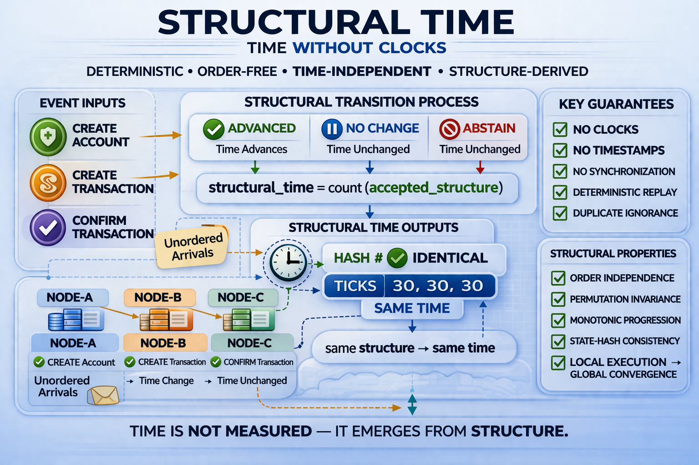

# ⭐ Structural Time (STIME)

**Time Without Clocks — Structural Transition System**


---

Time without clocks.  
Truth without time.

**Time is not measured.**  
**Time is resolved.**

---

## ⚡ **Deterministic Time Emerges From Structure**

`correctness = structure`

---

## ⚡ **Structure-Based Time Resolution • Open Reference Implementation**

same events  
different arrival order  
no clocks  
no synchronization  
independent nodes  

→ **same structural time**

**No Clock • No Order • No Coordinator**  
**Time emerges from structure — not from measurement**

---

## ⚡ **The Shift**

Time today is measured.  
Structural Time is resolved.

Traditional systems depend on:

- clocks  
- timestamps  
- synchronization  

Structural Time depends on:

- structure alone  

Same events  
Same structure  
Same time  

---

## ⚠️ **Important**

**Structural Time is NOT a replacement for wall-clock time.**

It does not replace clocks, calendars, duration measurement, or scheduling systems.  
It removes the need for clocks when determining **correctness** and **structural progression**.

---

## ⚡ **The Breakthrough**

Three independent systems receive:

- delayed events  
- unordered inputs  
- incomplete information  

And still converge to:

- the same structural time  
- the same structural state  

No shared clocks.  
No ordering guarantees.  
No synchronization.  

Yet time is identical.

---

## ⚡ **The Shock**

Structural time matched across systems

- without clocks  
- without synchronization  
- without synchronized communication  

→ because time was never being measured

It was being resolved.

---

## 🧭 **Visual Overview**



---

## 📊 **One-Page Comparison**

See how Structural Time compares with traditional and logical clocks:

[📊 Structural Time — Comparison Table](docs/Structural-Time-Comparison.md)

---

## ⚡ **Try it in 30 seconds**

### ▶ **Interactive Structural Time (Visual Demo)**

Open in browser:

`demo/structural_time_interactive_demo.html`

### ▶ **Reference Structural Time (Event-Based)**

Run:

```
python demo/structural_time.py
```

### ▶ **AI-Style Structural Time (Signal-Based)**

Run:

```
python demo/structural_time_ai_demo.py
```

---

## 👀 **Observe**

- different event / signal orders  
- safe abstains  
- duplicate suppression  
- independent execution  

→ **same final structural time**

---

## ⚡ **How to Read the Demo (Important)**

`ADVANCED` → valid structural transition → time moves  
`NO_CHANGE` → duplicate → ignored safely  
`ABSTAIN` → invalid / premature → rejected safely  

nodes may diverge during processing  
nodes converge only when structure is complete  

---

## 🔗 **Quick Links**

### 📘 Docs

- [Quickstart](docs/Quickstart.md)
- [FAQ](docs/FAQ.md)
- [Test Guide](docs/Test-Guide.md)
- [Proof Sketch](docs/Proof-Sketch.md)
- [Structural Time Overview](docs/Structural-Time-Overview.png)
- [Comparison Table](docs/Structural-Time-Comparison.md)

---

### ⚡ Demos

- [Python Reference Demo](demo/structural_time.py)
- [AI-Style Demo](demo/structural_time_ai_demo.py)
- [Interactive Visual Demo](demo/structural_time_interactive_demo.html)

---

### 🔍 Verification

- [Verify Instructions](VERIFY/VERIFY.txt)
- [Demo Hash Freeze](VERIFY/FREEZE_DEMO_SHA256.txt)

---

### 📂 Repository

[demo/](demo/) · [docs/](docs/) · [VERIFY/](VERIFY/)

---

## ⚡ **Structural Invariant**

same accepted structure → same structural time

**Important:**

same structural time does **NOT** guarantee same structure

Structural Time preserves conflict visibility  
and does not force false convergence

---

## ⚡ **Core Identity**

`correctness != time + order + synchronization`

`structural_time = count(accepted transitions)`

---

## ⚡ **Governance Model (Critical)**

valid transition → `ADVANCED`  
duplicate → `NO_CHANGE`  
invalid → `ABSTAIN`

No artificial advancement.  
No unsafe transitions.

---

## ⚖️ **What Structural Time IS**

- a structural transition system  
- a deterministic temporal model  
- a convergence-based notion of time  
- a correctness-driven time representation  

---

## ⚠️ **What This Is NOT**

- a wall-clock replacement  
- a timestamping protocol  
- a scheduling system  
- a calendar system  
- a time display mechanism  

---

## 💡 **Minimal Definition**

`S = set of events`  
`T = valid structural transitions`

`structural_time = count(T)`

---

## 🧮 **Structural Guarantees**

- Determinism  
- Order Independence  
- Time Independence  
- Replay Safety  
- Offline Convergence  

---

## 🔁 **Replay Guarantee**

same structure → same time

even if:

- events arrive differently  
- systems are offline  
- delays exist  

---

## 🌍 **Why This Matters**

**Traditional systems:**
- depend on clocks  
- require synchronization  
- degrade under delay  

**Structural Time:**
- removes clock dependency  
- enables offline systems  
- ensures deterministic consistency  

---

## 🧭 **Adoption Path**

**Immediate:**
- validation layer  
- audit layer  

**Advanced:**
- clock-free systems  
- distributed infrastructure  

---

## 🧾 **Structural Lineage**

- [SSUM-Time](https://github.com/OMPSHUNYAYA/SSUM-Time) → time from structure  
- [STOCRS](https://github.com/OMPSHUNYAYA/STOCRS) → computation from structure  
- [ORL](https://github.com/OMPSHUNYAYA/Orderless-Ledger) → ledger truth from structure  
- [ORL-Money](https://github.com/OMPSHUNYAYA/ORL-Money) → financial correctness  
- [ORL-Chat](https://github.com/OMPSHUNYAYA/ORL-Chat) → meaning resolution  
- [ORL-AI](https://github.com/OMPSHUNYAYA/ORL-AI) → decision systems  
- Structural Time → time itself from structure  

---

## 📜 **License**

See: [LICENSE](LICENSE)

Reference Implementation: 
**Open Standard** — free to use, study, implement, extend, and deploy

Architecture:
CC BY-NC 4.0

---

## ⚡ **Final Truth**

Events arrived in different orders.  
Systems were unsynchronized.  
Time was never shared.

Yet time was the same.

Time was never being kept or synchronized.

It was always being resolved.
